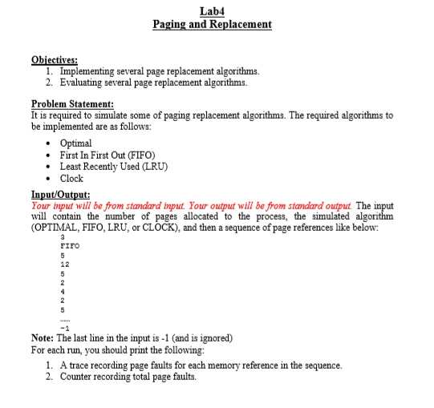
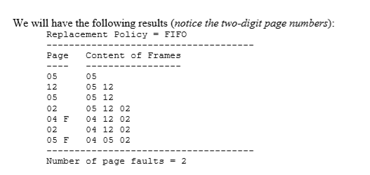

# Operating Systems Course -Alexandria University 
# Page_Replacement_Simulation
This program simulates some of the page replacement algorithms. [ Optimal , First In First Out (FIFO) , Least Recently Used (LRU) , Clock]
# Problem Statement:
It is required to simulate some of paging replacement algorithms. The required algorithms to be implemented are as follows: 
 Optimal 
 First In First Out (FIFO)
 Least Recently Used (LRU) 
 Clock 

